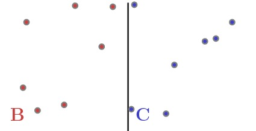
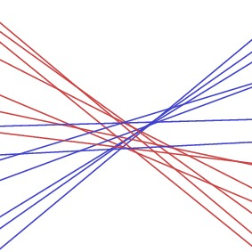
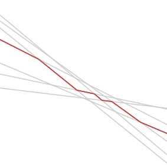
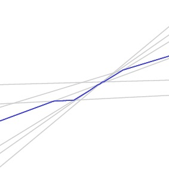
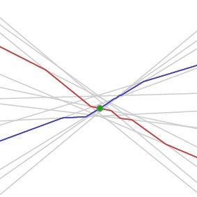
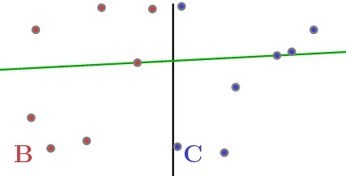
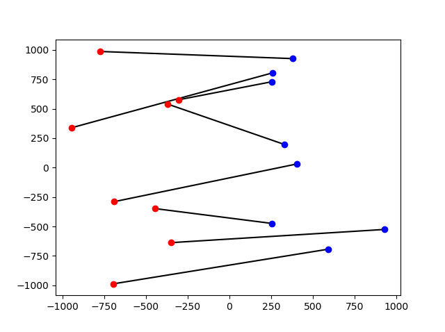

# The "ghosts vs busters" problem

Suppose we have `n` points on each side of the plane, divided by the ordinate (`x = 0`).

We would like to pair all of the points, so that the connecting lines do not intersect.

## Standard solution

The problem is usually solved through a convex hull approach. First, a covex hull of the entire point cloud is constructed. Most segments are red-red and blue-blue; on each iteration, two red-blue segments can be removed. This is repeated until no further segments remain.

Once the point cloud is sorted, [Andrew's algorithm](https://en.wikipedia.org/wiki/Convex_hull_algorithms) can be used to construct the convex hull in linear time. The total number of loops is `n`, which brings the complexity of the algorithm to quadratic.

The convex hull approach is simple and robust. In the given code, it is used as a "backup" (appropriate for hand-made examples, where collinearity can be an issue). Its use is recommended for `n <= 1000`, before its complexity becomes an issue. It should be able to solve the problem for `n = 8000` in approximately `5` seconds.

## Ham-sandwich cut approach

The problem can be approached differently: if we could find a bisecting line, such that half of the red and blue points remained above and half below, we could do this recursively until a single pair is reached.

The so called "ham-sandwich cut" is not trivially determined. First, the points are viewed as lines in the dual plane:

Due to the formulation of the problem, all red lines are descending and all blue lines are ascending. As a consequence, the "median line" (half of the lines above and half below) for both colours is monotone:

Since they are both monotone, their intersection is unique:

Viewed in the primal plane, this intersection forms the bisecting line for the ham-sandwich cut:

Theoretically, `O(nlogn)` complexity can be thus achieved. The given implementation is suboptimal, although considerably faster than the convex hull approach. Using it, the problem can be solved for `n >= 30000` in under `5` seconds.

#### Note

Credit for the above images goes to: <http://www.ams.org/publicoutreach/feature-column/fc-2011-12)>.

##  End result

