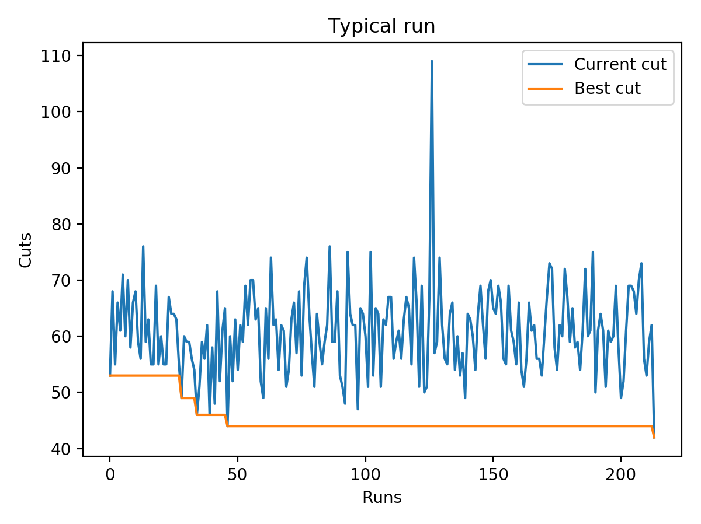
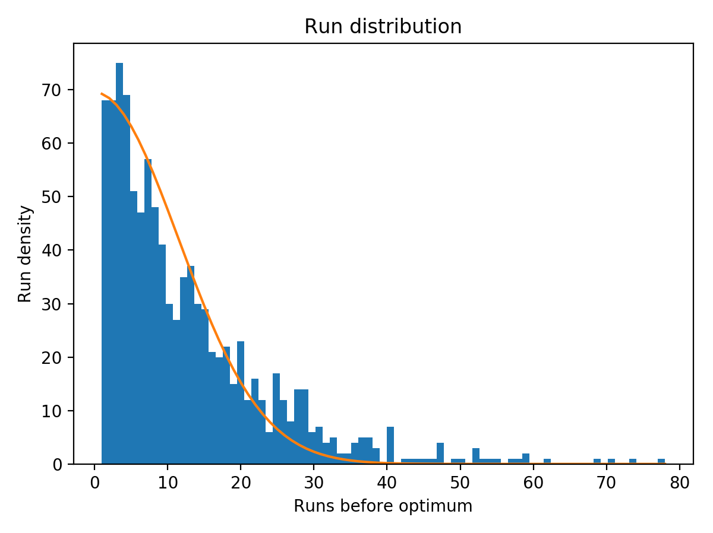

# Analysis of the Karger's (contraction) algorithm

`karger_analysis.py` provides the following core definitions:
- `karger`: return a cut after a single pass of the algorithm
- `cut_groups`: return vertex groups corresponding to a random cut
- `mincut_groups`: return vertex groups corresponding to a minimum cut

For purposes of analysis, certain plotting and IO functions are provided as well.

## Usage

The tools are implemented in `Python3` and can be easily imported (assuming you've put `karger_analysis.py` into your working directory):

```python
import karger_analysis as kga
```

Additionally, CLI functionality is provided for convenience.

### Examples

The following examples assume you've put `g1-16.txt`, `g5-42.txt`, `g5-42_plot.txt` and `g1-16_hist.txt` into your working directory.

#### Measure execution time

```sh
$ python karger_analysis.py time g1-16.txt
0.015009300000000003
```

```sh
$ python karger_analysis.py time g5-42.txt
6.388914500000001
```

#### Plot a typical run

```sh
$ python karger_analysis.py plot g5-42_plot.txt
```



#### Plot run distribution

```sh
$ python karger_analysis.py hist g1-16_hist.txt
```


